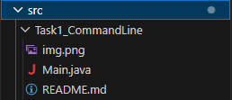
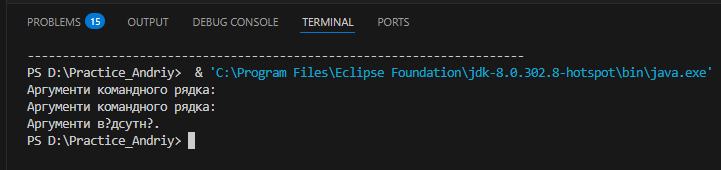
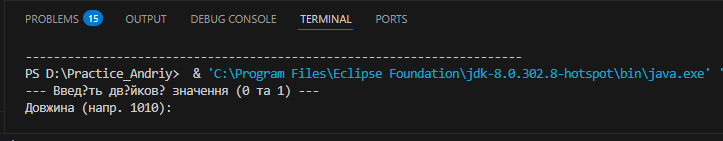
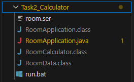
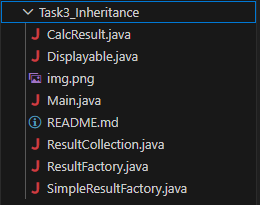
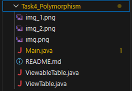
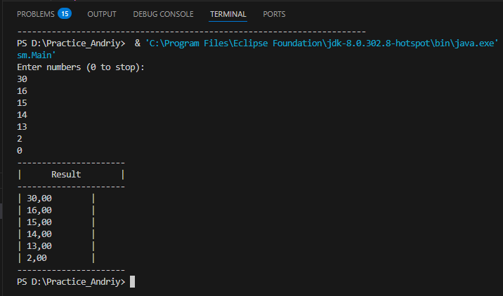
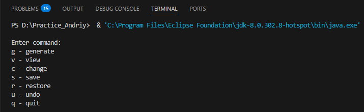
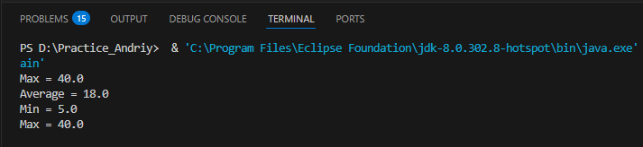

# 🚀 ООП Практика – Каленіченко Андрій Едуардович

## 📚 Загальна інформація

- **Студент:** Каленіченко Андрій Едуардович 
- **Група:**35 група
-  **Підгрупа:** 1 підгрупа(Олійник В.В.)
- **Мова програмування:** Java  

---
# 📚 Практичні завдання

## 🔹 Завдання 1 – Аргументи командного рядка

### Мета:
Розробити програму для роботи з аргументами командного рядка.

### Реалізовано:

- Виведення аргументів
- Перевірка їх наявності
- Обробка введених значень
## Результат роботи

---

## 🔹 Завдання 2 – Класи та об'єкти
7 варіант
### Мета:
- Розробити клас, що серіалізується, для збереження параметрів і результатів обчислень
- Реалізувати агрегацію для розв'язання задачі
- Продемонструвати збереження та відновлення об'єкта (серіалізація/десеріалізація)
- Показати використання transient полів
- Створити тестовий клас

### Реалізовано:

- `RoomApplication` – головний клас програми, що містить метод main() та забезпечує взаємодію з користувачем і виклик основної логіки
- `BinRoomCalculator` – клас, який реалізує обчислювальну логіку (агрегує інші класи та виконує операції над даними)
- `RoomData` – клас даних, що реалізує інтерфейс Serializable, використовується для збереження та відновлення стану об'єкта
- `Sroom.ser` – файл серіалізації, у який зберігається об'єкт класу RoomData для подальшого відновлення
- `run.bat` – командний файл для автоматизованого запуску програми
#### Результат виконання програми:

---

### 🔹 Завдання 3 – Спадкування (Factory Method)

#### Мета:

- Використати результати попередньої лабораторної роботи
- Реалізувати збереження результатів у колекції
- Використати шаблон проєктування Factory Method (Virtual Constructor)
- Реалізувати ієрархію класів для розширення системи
- Створити інтерфейс для відображення результатів

#### Реалізовано:

- `Displayable` – інтерфейс для відображення результатів
- `CalcResult` – клас результату обчислення
- `ResultCollection` – колекція для збереження результатів
- `ResultFactory` – інтерфейс фабрики
- `SimpleResultFactory` – реалізація Factory Method
#### Результат виконання програми:

  ---

### 🔹 Завдання 4 – Поліморфізм (Factory Method)

#### Мета:

- Набути практичних навичок використання поліморфізму
- Реалізувати перевизначення методів (overriding)
- Реалізувати перевантаження методів (overloading)
- Продемонструвати динамічне зв'язування (dynamic method dispatch)
- Реалізувати форматований вивід результатів у вигляді таблиці
- Створити тестовий клас

#### Реалізовано:

- `ViewTable` – клас для відображення результатів у вигляді таблиці
- `ViewableTable` – фабрика створення відображення (Factory Method)
- перевизначення методів (overriding)
- перевантаження методів (overloading)
- використання поліморфізму
- діалоговий інтерфейс з користувачем
- тестовий клас `MainTest`

#### Результат виконання програми:

---

# 🔹 Завдання 5 – Обробка колекцій (Command, Singleton)

## Мета:

Розробити програму для обробки колекції об'єктів із використанням шаблонів проєктування **Command** та **Singleton**.

## Реалізовано:

- Реалізовано шаблон **Command** для обробки команд користувача
- Створено клас **Menu** як контейнер команд (MacroCommand)
- Реалізовано шаблон **Singleton** у класі `Application`
- Реалізовано **консольний діалоговий інтерфейс**
- Додано можливість **скасування останньої операції (Undo)**
- Реалізовано **JUnit тестування**

---
## Тестування

Для перевірки роботи команд створено клас:
Тести перевіряють:

- коректність ключів команд
- правильність відображення назв команд
## Основні класи

- `Application` – керування програмою (Singleton)
- `Menu` – контейнер команд (MacroCommand)
- `Command` – інтерфейс команди
- `ConsoleCommand` – інтерфейс консольної команди
- `GenerateConsoleCommand` – команда генерації
- `ViewConsoleCommand` – команда перегляду
- `ChangeConsoleCommand` – команда зміни
- `SaveConsoleCommand` – команда збереження
- `RestoreConsoleCommand` – команда відновлення
- `Main` – запуск програми
- `MainTest` – тестування

---

## Доступні команди

| Команда | Дія |
|-------|------|
| g | Generate |
| v | View |
| c | Change |
| s | Save |
| r | Restore |
| u | Undo |
## Приклад результату

---

# Завдання 6 – Паралельне виконання
## Мета
Продемонструвати паралельну обробку елементів колекції та використання шаблону Worker Thread.

## Реалізовано

- Обчислення максимального значення
- Обчислення середнього значення
- Пошук мінімального та максимального значення
- Паралельне виконання задач
- Черга команд (CommandQueue)
- Використання шаблону **Worker Thread**

## Структура

- `Command` – інтерфейс команди
- `AvgCommand` – обчислення середнього значення
- `MaxCommand` – пошук максимального значення
- `MinMaxCommand` – пошук мінімуму та максимуму
- `CommandQueue` – черга задач
- `Main` – запуск програми

## Приклад результату

| 
---

## Висновок

У результаті виконання роботи було:

- реалізовано шаблон проектування **Observer**
- створено **графічний інтерфейс на Swing**
- використано **власні анотації**
- продемонстровано використання **Reflection**
"# Practice_Andriy" 
"# Practice_Andriy" 
